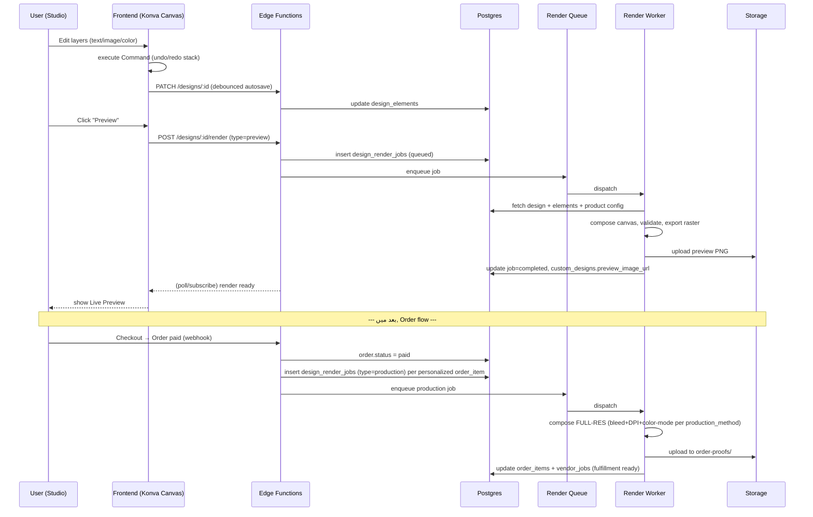

# Personalized Product Designer / Customization Studio — Complete Technical Plan

> Reference: `ARCHITECTURE.md`, `UI_UX_SPECIFICATION.md` (Screens 8–9: Personalization Studio + Live Preview), `DATABASE_SCHEMA.md` (`custom_designs`, `design_elements`, `product_customization_options`)۔ یہ document اسی foundation پر Customization Studio کا مکمل technical implementation plan ہے — design-only، ابھی code شروع نہیں کی گئی۔

---

## 1. Scope

Customization Studio وہ module ہے جہاں user کسی بھی personalizable product پر یہ فیلڈز edit کرتا ہے:

**Content layers:** Name · Initials · Text · Motivational Quote · Uploaded Image · Icons
**Typography:** Font · Font Size · Text Position · Text Alignment
**Visual:** Colors · Background · Patterns
**Meta:** Design Templates (start from preset)

**Core features:** Live preview · Undo/Redo · Reset · Save · Duplicate · Edit saved design · Mobile touch + Desktop interaction · Validation · Print-safe area · High-resolution export · Production-ready file۔

**سب سے اہم architectural اصول (پہلے document میں بھی طے شدہ):** Studio **config-driven** ہے — کوئی product-specific hardcoded UI نہیں۔ ہر product کا `print_area_config` JSON بتاتا ہے کہ کتنی zones ہیں، ہر zone کس type کی ہے، اور اس کے constraints کیا ہیں۔ نیا product = نیا config، نیا frontend code نہیں۔

---

## 2. Product-Specific Customization Rules (Config-Driven Engine)

ہر product کی اپنی **print area، production method، اور allowed zones** ہیں۔ یہ فرق `print_area_config` (products table) + `product_customization_options` rows میں encode ہوتا ہے۔

### 2.1 Config Schema (per product)

```json
{
  "canvas": {
    "physical_width_mm": 610,
    "physical_height_mm": 1830,
    "render_width_px": 1200,
    "render_height_px": 3600,
    "shape": "rectangle",              // rectangle | cylinder_wrap | irregular
    "bg_image_url": "https://.../yoga_mat_mockup.png"
  },
  "production_method": "digital_print", // digital_print | laser_engrave | foil_emboss | screen_print
  "min_dpi": 150,
  "bleed_mm": 5,
  "safe_margin_mm": 15,
  "print_zones": [
    {
      "id": "full_surface_pattern",
      "type": "pattern",
      "shape": "rect",
      "bounds": { "x": 0, "y": 0, "w": 1200, "h": 3600 },
      "options": ["solid_color", "geometric", "floral", "custom_upload"]
    },
    {
      "id": "center_name_text",
      "type": "text",
      "shape": "rect",
      "bounds": { "x": 300, "y": 1700, "w": 600, "h": 200 },
      "max_chars": 20,
      "fonts": ["Poppins", "Fraunces", "Amiri"],
      "font_size_range": [24, 72],
      "alignment_options": ["left", "center", "right"],
      "color_palette": ["#1F2420", "#FAF7F2", "#C97C5D"]
    }
  ]
}
```

### 2.2 Product-by-Product Differences (مثالیں)

| Product | Shape | Production Method | Key Zones | Special Rule |
|---|---|---|---|---|
| **Yoga Mat** | Flat rectangle (large format) | `digital_print` | full-surface pattern + center name text + corner icon | بڑا safe-margin (15mm) — rolled edges پر distortion سے بچاؤ؛ 150 DPI کافی (viewing distance زیادہ) |
| **Water Bottle** | **Cylinder wrap** (unrolled rectangle = height × circumference) | `digital_print` | wrap-around label + cap engraving text | **Seam-safe zone**: design کا کوئی critical content bottle کے seam-overlap edge (±10mm) پر نہ ہو؛ curvature distortion warning zone کناروں پر |
| **Fitness Tracker/Planner** | Flat cover (front+spine+back) | `digital_print` | cover full-print + spine text + name embossing zone | Spine zone صرف text (narrow width constraint، max 15 chars) |
| **Essential Oil Diffuser** | Small curved surface | **`laser_engrave`** | single engraving zone (text/simple icon only) | صرف **vector, single-color, no gradient/photo** — raster images disallowed؛ engraving کے لیے path-based font صرف |
| **Motivational Gum Bag** | Small flat packaging area | `digital_print` (low-cost) | single message-text zone | بہت چھوٹا max_chars (40)، کوئی image upload نہیں — cost-control کے لیے text-only |
| **Gratitude Journal** | Flat cover | `digital_print` + optional **`foil_emboss`** name | cover full-print + optional foil name-stamp zone | Foil zone انتخاب کرنے پر user کو صرف plain text (کوئی color picker نہیں — foil ایک ہی metallic رنگ ہوتا ہے) |

### 2.3 Engine Rule
Frontend Customization Studio ہمیشہ `print_zones[]` iterate کر کے UI بناتا ہے — `type` کی بنیاد پر صحیح tool render ہوتا ہے:
```
type=text        → Text tool (font/size/align/color panel)
type=image        → Image upload + crop/position panel
type=color/pattern → Swatch/pattern picker
type=icon          → Icon library picker
```
`production_method` decide کرتا ہے کہ backend render pipeline raster استعمال کرے یا vector (section 4.5)۔

---

## 3. Frontend Architecture

### 3.1 Tech & Component Tree
- **Canvas engine:** Konva.js (`react-konva`) — 2D layer-based editing، performant drag/transform، اچھا touch support۔
- **State:** Zustand store (`useCustomizerStore`) — layers array + undo/redo command stack + selected-layer + zoom/pan state۔ Server data (product config, saved draft) TanStack Query سے۔

```
components/customizer/
├── CustomizerCanvas.tsx        # Konva Stage + Layer rendering loop
├── CustomizerToolbar.tsx       # tool switcher (text/image/color/icon/template)
├── panels/
│   ├── TextPanel.tsx           # font, size, align, color
│   ├── ImagePanel.tsx          # upload, crop, position, scale
│   ├── ColorPatternPanel.tsx
│   ├── IconPanel.tsx
│   └── TemplatePanel.tsx
├── LayerList.tsx               # reorder/delete/visibility
├── SafeAreaOverlay.tsx         # print-safe/bleed guide lines
├── UndoRedoControls.tsx
└── ValidationBanner.tsx        # inline validation warnings
```

### 3.2 Layer / Element Model (client-side)
ہر element = ایک object، `design_elements` table کے shape سے مطابقت رکھتا ہے (section 5):
```ts
type DesignElement = {
  id: string;              // client-generated uuid (temp until save)
  zoneKey: string;         // matches print_zones[].id
  elementType: 'text' | 'image' | 'color_fill' | 'pattern' | 'icon';
  content: string;         // text value OR asset URL
  fontFamily?: string;
  fontSize?: number;
  colorHex?: string;
  alignment?: 'left' | 'center' | 'right';
  x: number; y: number;
  scale: number;
  rotation: number;
  zIndex: number;
};
```

### 3.3 State Management & Undo/Redo (Command Pattern)
ہر mutation ایک **command** ہے جس کا `do()`/`undo()` ہو — snapshot-diffing کی بجائے command-pattern سستا اور predictable ہے۔
```ts
interface Command {
  do(state: CustomizerState): CustomizerState;
  undo(state: CustomizerState): CustomizerState;
  label: string; // e.g. "Add text", "Move layer"
}

class UpdateElementCommand implements Command {
  constructor(private elementId: string, private before: Partial<DesignElement>, private after: Partial<DesignElement>) {}
  do(state)   { return updateElement(state, this.elementId, this.after); }
  undo(state) { return updateElement(state, this.elementId, this.before); }
}

// store:
undoStack: Command[] = []
redoStack: Command[] = []

function execute(cmd: Command) {
  state = cmd.do(state);
  undoStack.push(cmd);
  redoStack = [];              // نئی action پر redo history clear
}
function undo() {
  if (!undoStack.length) return;
  const cmd = undoStack.pop();
  state = cmd.undo(state);
  redoStack.push(cmd);
}
function redo() {
  if (!redoStack.length) return;
  const cmd = redoStack.pop();
  state = cmd.do(state);
  undoStack.push(cmd);
}
```
- Drag/transform جیسی continuous actions **debounced/batched** ہوتی ہیں (mouseup/touchend پر ایک ہی command push ہو، ہر pixel move پر نہیں)۔
- Undo-stack size cap (مثلاً 50) — memory bound۔
- **Reset design** = ایک `ResetCommand` جو پورا state initial/blank state پر لے جائے (خود بھی undoable)۔

### 3.4 Live Preview Rendering
- **In-canvas live preview**: Konva خود real-time render کرتا ہے — کوئی separate "preview mode" نہیں چاہیے مین editor میں (WYSIWYG)۔
- **Product mockup preview** (Live Product Preview screen، section 9 UI spec): editor سے الگ — canvas کا flattened PNG export (client-side `stage.toDataURL()`) mockup image پر overlay ہو کر "photorealistic" جیسا preview بنتا ہے۔ Complex cases (cylinder wrap جیسے bottle) میں CSS/WebGL warp transform (یا سادہ pre-rendered angle-mockup) استعمال ہو۔
- Preview image **server پر بھی generate ہوتا ہے** (section 4.5) — ہمیشہ client-render پر انحصار نہ کریں (cart/order کے لیے authoritative preview server-side ہونا چاہیے)۔

### 3.5 Desktop Interaction
| Action | Interaction |
|---|---|
| Move layer | Mouse drag |
| Resize/rotate | Corner handles (Konva Transformer) |
| Zoom canvas | Scroll wheel / `Ctrl +/-` |
| Undo/Redo | `Ctrl+Z` / `Ctrl+Shift+Z` |
| Delete layer | `Delete`/`Backspace` key |
| Nudge position | Arrow keys (1px), `Shift+Arrow` (10px) |
| Duplicate layer | `Ctrl+D` |
| Multi-select | `Shift+Click` |
| Layer context menu | Right-click |
| Smart alignment | Snap-guides (Figma-style) جب layer دوسرے layer/center کے قریب آئے |

### 3.6 Mobile Touch Interaction
| Action | Gesture |
|---|---|
| Move layer | Single-finger drag (selected layer پر) |
| Zoom canvas | Pinch |
| Rotate layer | Two-finger rotate on selected layer |
| Edit text inline | Double-tap |
| Layer context menu | Long-press → bottom-sheet (delete/duplicate/bring-to-front) |
| Tool panels | Collapsible bottom-sheet (ایک وقت میں ایک panel) |
| Safe-area guide | Layer drag کے دوران highlight ہو اگر boundary کے قریب/باہر جائے |
| Undo/Redo | Fixed top toolbar buttons (keyboard shortcuts موجود نہیں mobile پر) |

### 3.7 Client-Side Design Validation (real-time، submit سے پہلے بھی)
- Text: `content.length <= max_chars` (zone config سے)۔
- Position: element bounds `print_zones[].bounds` کے اندر ہوں (drag کے دوران constrain یا warning)۔
- Image: min resolution check — uploaded image pixel-dimensions vs zone physical size پر based `min_dpi` calculation (section 8.3)۔
- Required zones: `is_required=true` zones خالی نہ رہیں (Save/Add-to-Cart سے پہلے block)۔
- Engrave-method products: صرف text/vector icons allowed، raster image upload tool disabled/hidden۔
- Validation results → `ValidationBanner` (inline، blocking صرف "Add to Cart" پر، warnings کے طور پر باقی جگہ)۔

### 3.8 Print-Safe Area Visualization
- `SafeAreaOverlay`: canvas پر dashed outline — **bleed line** (باہر، red) اور **safe margin line** (اندر، amber) دکھاتا ہے، `bleed_mm`/`safe_margin_mm` سے convert ہو کر canvas px میں۔
- Toggle button ("Show print guides") — by default on زیادہ novice users کے لیے۔
- Cylinder-wrap products (bottle) میں اضافی **seam-safe zone** highlight (section 2.2)۔

---

## 4. Backend Architecture

### 4.1 API Layer Overview
- Draft CRUD → Supabase PostgREST (RLS-protected, direct) — سادہ reads/writes۔
- Business logic (validation, render, finalize, duplicate) → **Edge Functions** (service-role, server-authoritative)۔
- Render jobs → **queue-based worker** (BullMQ+Redis یا Supabase Cron+Edge Function polling) — کبھی heavy render request-response cycle میں synchronous نہ ہو۔

### 4.2 Draft Save / Load
- **Autosave**: frontend ہر meaningful command کے بعد debounced (اندازاً 2s) `PATCH /designs/:id` بھیجتا ہے — پورا `layers[]` array replace (idempotent، simple)۔
- **Explicit Save**: user "Save Design" دبائے تو `status: draft → saved` + toast confirmation۔
- Load: `GET /designs/:id` → design_elements + product config دونوں ایک ساتھ (single round-trip)۔

### 4.3 Server-Side Validation (کبھی صرف client پر انحصار نہ کریں)
Edge Function `validate-design`:
1. ہر element کی zone_key کا `product_customization_options` میں موجود ہونا verify کریں۔
2. Text length, required-zones, image-resolution دوبارہ server پر check (client bypass ممکن ہے)۔
3. Optional: profanity/inappropriate-content filter (text پر) — flag ہونے پر design کو `pending_review` مارک کریں، admin queue میں بھیجیں (block نہ کریں مگر order سے پہلے review لازمی)۔
4. Response: `{ valid: boolean, errors: [{zoneKey, message}], warnings: [...] }`۔

### 4.4 Render / Export Pipeline
```
Trigger: "Finalize design" (add-to-cart سے پہلے) یا Order paid (production file)
   │
   ▼
enqueue render_job (design_render_jobs table, status=queued)
   │
   ▼
Worker picks job (BullMQ consumer)
   │
   ├─ Fetch: custom_designs + design_elements + products.print_area_config
   ├─ Compose layers on server-side canvas (node-canvas / sharp / resvg for vector)
   │    ├─ digital_print  → raster composite at target DPI (PNG/JPEG)
   │    ├─ laser_engrave  → vector-only SVG → single-path export (no raster)
   │    └─ foil_emboss    → vector text outline → cutting-plotter-safe SVG
   ├─ Apply bleed + safe-margin guides (embedded as non-printing layer, QA کے لیے)
   ├─ Validate output (resolution check, color-mode check)
   └─ Upload to Storage bucket (`personalization-renders` یا `order-proofs`)
   │
   ▼
Update design_render_jobs.status=completed + custom_designs.render_image_url
   │
   ▼
(اگر order-triggered) → vendor_jobs row create/update (fulfillment ARCHITECTURE.md §10)
```

### 4.5 High-Resolution Export & Production-Ready File
| Method | Output format | Color mode | DPI/Precision | Notes |
|---|---|---|---|---|
| `digital_print` | PNG (flattened) + PDF (print-shop delivery) | CMYK conversion at export (from RGB working file) | 300 DPI (small items), 150 DPI (large-format mat) | Bleed included in canvas size, crop-marks optional PDF layer |
| `laser_engrave` | SVG (vector paths only) | N/A (monochrome) | Vector — resolution-independent | Text کبھی raster نہیں — font outline path میں convert ہو |
| `foil_emboss` | SVG (vector paths) | N/A (single foil color) | Vector | Stroke-width minimum enforce (production machine limit) |

**Two-stage render:**
1. **Preview render** (fast, low-res, sync-ish, "Live Product Preview" screen کے لیے) — ~1024px raster, seconds میں مکمل۔
2. **Production render** (slow, full-res, async job، order paid ہونے پر trigger) — bleed/DPI-accurate final file۔

### 4.6 File Storage Structure (Supabase Storage buckets)
```
product-assets/            (public)   — product mockups, icon library, template previews
user-uploads/               (private)  — raw user-uploaded images (pre-processing)
personalization-renders/    (private)  — preview renders (fast, low-res)
order-proofs/                (private)  — final production-ready files (high-res, per order_item)
```
Access: signed URLs (short-lived) client کے لیے؛ service-role direct access worker کے لیے۔

---

## 5. Database Schema Extensions

`DATABASE_SCHEMA.md` میں `custom_designs`/`design_elements`/`product_customization_options` پہلے سے define ہیں۔ Studio کے لیے دو اضافی tables چاہئیں:

```sql
create type render_job_status as enum ('queued','processing','completed','failed');
create type render_job_type   as enum ('preview','production');

create table design_render_jobs (
  id               uuid primary key default gen_random_uuid(),
  design_id        uuid not null references custom_designs(id) on delete cascade,
  order_item_id    uuid references order_items(id) on delete set null,
  job_type         render_job_type not null default 'preview',
  status           render_job_status not null default 'queued',
  output_file_url  text,
  error_message    text,
  requested_by     uuid references users(id),
  started_at       timestamptz,
  completed_at     timestamptz,
  created_at       timestamptz not null default now()
);
create index idx_render_jobs_design on design_render_jobs(design_id);
create index idx_render_jobs_status on design_render_jobs(status) where status in ('queued','processing');
```
```sql
create type asset_moderation_status as enum ('pending','approved','rejected');

create table design_assets (
  id                  uuid primary key default gen_random_uuid(),
  user_id             uuid not null references users(id) on delete cascade,
  file_url            text not null,
  width_px            int,
  height_px           int,
  file_size_bytes     int,
  mime_type           varchar(50),
  moderation_status   asset_moderation_status not null default 'pending',
  created_at          timestamptz not null default now()
);
create index idx_design_assets_user on design_assets(user_id);
```
```sql
-- design_elements میں image-type elements کے لیے asset reference:
alter table design_elements
  add column asset_id uuid references design_assets(id) on delete set null;
```
- **Relationship:** `custom_designs 1:N design_render_jobs`؛ `users 1:N design_assets`؛ `design_elements N:1 design_assets` (optional، صرف `element_type='image'` کے لیے)۔
- **RLS:** دونوں tables پر `user_id = auth.uid()` (design_render_jobs کے لیے design ownership کے ذریعے join-based policy)۔

---

## 6. File-Generation Workflow (End-to-End Sequence)



---

## 7. Pseudocode

### 7.1 Frontend — Add Text Element + Save (simplified)
```ts
function addTextElement(zoneKey: string, initialText: string) {
  const zoneConfig = getZoneConfig(zoneKey);
  const element: DesignElement = {
    id: uuid(),
    zoneKey,
    elementType: 'text',
    content: initialText.slice(0, zoneConfig.max_chars),
    fontFamily: zoneConfig.fonts[0],
    fontSize: clamp(32, zoneConfig.font_size_range),
    colorHex: zoneConfig.color_palette[0],
    alignment: 'center',
    x: zoneConfig.bounds.x + zoneConfig.bounds.w / 2,
    y: zoneConfig.bounds.y + zoneConfig.bounds.h / 2,
    scale: 1, rotation: 0, zIndex: getNextZIndex(),
  };
  execute(new AddElementCommand(element));   // undo-able
  validateDesign();                          // inline warnings refresh
}

function validateDesign(): ValidationResult {
  const errors = [];
  for (const el of state.elements) {
    const zone = getZoneConfig(el.zoneKey);
    if (el.elementType === 'text' && el.content.length > zone.max_chars)
      errors.push({ zoneKey: el.zoneKey, message: 'Text too long' });
    if (!isWithinBounds(el, zone.bounds))
      errors.push({ zoneKey: el.zoneKey, message: 'Outside print area' });
    if (el.elementType === 'image') {
      const dpi = computeEffectiveDPI(el.asset, zone.bounds, product.physical_size_mm);
      if (dpi < product.min_dpi)
        errors.push({ zoneKey: el.zoneKey, message: 'Image resolution too low for print' });
    }
  }
  for (const zone of product.print_zones.filter(z => z.is_required))
    if (!state.elements.some(e => e.zoneKey === zone.id))
      errors.push({ zoneKey: zone.id, message: 'Required field missing' });
  return { valid: errors.length === 0, errors };
}

// debounced autosave
const autosave = debounce(async () => {
  await api.patch(`/designs/${draftId}`, { layers: serialize(state.elements) });
}, 2000);

store.subscribe(() => autosave());
```

### 7.2 Backend — Render Worker (Node.js, simplified)
```ts
async function processRenderJob(jobId: string) {
  const job = await db.designRenderJobs.get(jobId);
  await db.designRenderJobs.update(jobId, { status: 'processing', started_at: now() });

  try {
    const design   = await db.customDesigns.get(job.design_id);
    const elements = await db.designElements.listByDesign(job.design_id);
    const product  = await db.products.get(design.product_id);
    const config   = product.print_area_config;

    const isVector = config.production_method !== 'digital_print';
    const canvas = isVector
      ? createVectorCanvas(config)   // SVG document (resvg / svg.js)
      : createRasterCanvas(config, job.job_type === 'production' ? config.min_dpi : 72);

    for (const el of sortByZIndex(elements)) {
      const zone = config.print_zones.find(z => z.id === el.zone_key);
      renderElementOntoCanvas(canvas, el, zone, { isVector });
    }

    if (job.job_type === 'production') {
      validateProductionOutput(canvas, config);   // resolution, color-mode, bleed checks
      drawBleedGuides(canvas, config.bleed_mm, config.safe_margin_mm); // non-printing QA layer
    }

    const fileBuffer = isVector ? canvas.toSVGBuffer() : canvas.toPNGBuffer();
    const bucket = job.job_type === 'production' ? 'order-proofs' : 'personalization-renders';
    const url = await storage.upload(bucket, `${design.id}/${job.id}.${isVector ? 'svg' : 'png'}`, fileBuffer);

    await db.designRenderJobs.update(jobId, { status: 'completed', output_file_url: url, completed_at: now() });

    if (job.job_type === 'preview')
      await db.customDesigns.update(design.id, { preview_image_url: url });
    else {
      await db.customDesigns.update(design.id, { render_image_url: url });
      await db.orderItems.update(job.order_item_id, { fulfillment_status: 'design_ready' });
      await triggerVendorJob(job.order_item_id, url);
    }
  } catch (err) {
    await db.designRenderJobs.update(jobId, { status: 'failed', error_message: err.message });
    await notifyAdmin('render_job_failed', jobId);
  }
}
```

### 7.3 Backend — Save/Duplicate/Finalize Handlers (pseudocode)
```ts
// PATCH /designs/:id
async function updateDesign(req) {
  assertOwnership(req.user, req.params.id);
  await db.designElements.replaceAll(req.params.id, req.body.layers);
  await db.customDesigns.touch(req.params.id); // updated_at
  return { ok: true };
}

// POST /designs/:id/duplicate
async function duplicateDesign(req) {
  const original = await loadDesignWithElements(req.params.id, req.user.id);
  const copy = await db.customDesigns.create({
    user_id: req.user.id, product_id: original.product_id,
    name: `${original.name} (Copy)`, status: 'draft',
  });
  await db.designElements.bulkInsert(copy.id, original.elements);
  return copy;
}

// POST /designs/:id/finalize   (add-to-cart سے پہلے)
async function finalizeDesign(req) {
  const result = await validateDesignServerSide(req.params.id);
  if (!result.valid) return { status: 422, errors: result.errors };
  await enqueueRenderJob(req.params.id, 'preview');
  await db.customDesigns.update(req.params.id, { status: 'saved' });
  return { ok: true };
}
```

---

## 8. API Endpoints

```
GET    /functions/v1/products/:id/customizer-config
       → { print_area_config, customization_options[], design_templates[] }

POST   /functions/v1/designs
       body: { productId }                              → create new draft (empty)

GET    /functions/v1/designs/:id
       → { design, elements[], productConfig }           (load for edit)

PATCH  /functions/v1/designs/:id
       body: { layers: DesignElement[] }                 (autosave / explicit save)

POST   /functions/v1/designs/:id/validate
       → { valid, errors[], warnings[] }                 (server-side re-validation)

POST   /functions/v1/designs/:id/render
       body: { jobType: 'preview' | 'production' }       → { jobId } (async)

GET    /functions/v1/render-jobs/:id
       → { status, outputFileUrl?, errorMessage? }        (poll or Realtime subscribe)

POST   /functions/v1/designs/:id/duplicate
       → new design (full copy, status=draft)

DELETE /functions/v1/designs/:id
       → soft-delete draft

POST   /functions/v1/designs/:id/finalize
       → validate + enqueue preview render + status=saved  (add-to-cart سے پہلے)

POST   /functions/v1/designs/:id/reset
       → clears elements, keeps design row (undoable client-side قبل از commit)

GET    /functions/v1/designs/templates?productId=:id
       → public/admin design_templates list

POST   /functions/v1/uploads/design-image
       body: { fileName, mimeType }
       → { uploadUrl (signed), assetId }                 (client direct-upload flow)

-- Admin (product config authoring):
POST   /functions/v1/admin/products/:id/print-zones
PATCH  /functions/v1/admin/products/:id/print-zones/:zoneId
```

**Auth:** ہر endpoint پر `Authorization: Bearer <jwt>`؛ ownership check (`design.user_id = auth.uid()`) ہر design-scoped route پر server-side enforce ہو، RLS + Edge Function دونوں layer پر (defense-in-depth)۔

---

## 9. Save / Duplicate / Edit Saved Design — Flows

| Flow | Steps |
|---|---|
| **Save Design** | Studio میں "Save" tap → `finalize` (validate + preview render) → status=`saved` → toast → "My Designs" میں نظر آئے |
| **Duplicate** | My Designs screen سے "Duplicate" → `POST /designs/:id/duplicate` → نیا draft بنے، اصل design untouched رہے |
| **Edit Saved Design** | My Designs سے design tap → Studio load ہو `GET /designs/:id` سے (elements + product config) → undo/redo stack fresh session سے شروع ہو (پرانی history persist نہیں ہوتی) |
| **Reset Design** | Studio میں "Reset" → confirmation dialog ("سب تبدیلیاں ختم ہو جائیں گی") → `ResetCommand` execute (undoable) |
| **Add to Cart** (design "locked") | Live Preview سے "Add to Cart" → `cart_items.design_id` set → **design_snapshot order کے وقت order_items میں freeze ہوتا ہے** (DATABASE_SCHEMA.md کے مطابق) — بعد میں design edit ہو تو پرانا order متاثر نہ ہو |

---

## 10. Design Validation Rules (Reference Table)

| Rule | Layer | Enforcement |
|---|---|---|
| Text length ≤ `max_chars` | Client + Server | Inline block on type; server re-check |
| Required zones filled | Client + Server | Block "Add to Cart"/finalize |
| Element within zone bounds | Client (drag-constrain) + Server | Snap-back on drag; reject on finalize |
| Image resolution ≥ `min_dpi` (effective DPI = image_px_width / (zone_width_mm / 25.4)) | Client (warn) + Server (block) | Warning banner on upload; hard block at finalize |
| Engrave/emboss zones: text/vector only | Client (tool disabled) + Server | Image-upload tool hidden for these zones |
| Color within `color_palette` (اگر restricted) | Client | Swatch-only picker, no free color اگر config محدود کرے |
| Profanity/inappropriate text (optional) | Server (async) | Flag → admin review queue، block نہیں کرتا مگر order سے پہلے clear ہونا چاہیے |
| Max layers per design (perf/production limit) | Client + Server | مثلاً max 15 elements — UI میں disable "Add" اس حد پر |

---

## 11. Mobile vs Desktop — Responsive Studio Layout Summary

| Aspect | Mobile | Desktop |
|---|---|---|
| Toolbar | Bottom-sheet, collapsible, ایک panel at a time | Persistent side panel, multi-panel visible |
| Canvas | Full-width, pinch-zoom, safe-area guide اہم | Larger canvas + zoom controls, precise mouse control |
| Layer list | Swipe-to-reveal actions یا separate sheet | Always-visible sidebar list |
| Undo/redo | Toolbar buttons | Buttons + keyboard shortcuts |
| Text editing | Tap → native-feel inline editor + keyboard | Click → inline canvas text edit |
| Performance | Debounce renders زیادہ aggressively (lower-end devices) | Higher-fidelity live preview possible |

---

## 12. Production Readiness Checklist

- [ ] Config-driven print-zone engine (کوئی product hardcoding نہیں)
- [ ] Undo/redo command-stack (bounded, batched)
- [ ] Client + server dual-layer validation (کبھی صرف client پر بھروسہ نہیں)
- [ ] Two-stage render (fast preview + async high-res production)
- [ ] Vector pipeline الگ raster پیپلائن سے (engrave/emboss کے لیے)
- [ ] Bleed + safe-margin + DPI enforcement per production_method
- [ ] Order-time design snapshot freeze (immutability)
- [ ] Signed-URL direct upload (server کبھی raw file body proxy نہ کرے بڑی images کے لیے)
- [ ] Render job queue + retry/failure alerting (admin notified on failed production render — order fulfillment کبھی silently نہ رکے)

---

*یہ plan `ARCHITECTURE.md`, `UI_UX_SPECIFICATION.md` اور `DATABASE_SCHEMA.md` کے ساتھ مل کر Customization Studio کی implementation کے لیے مکمل بنیاد بناتا ہے۔ اگلا step (approval کے بعد): `design_render_jobs`/`design_assets` migrations apply کرنا اور Studio کا component scaffolding شروع کرنا۔*
