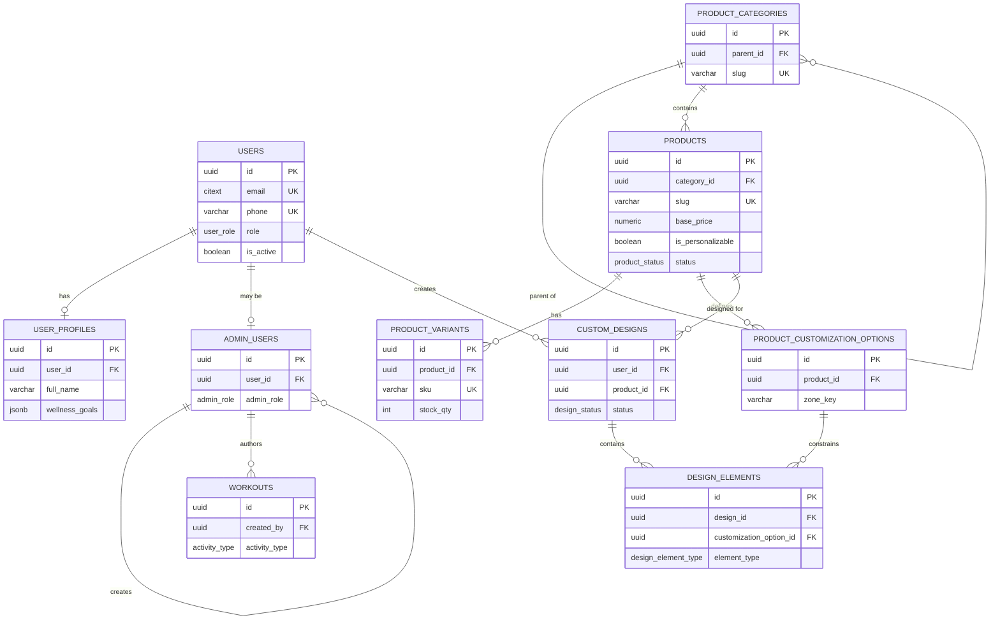
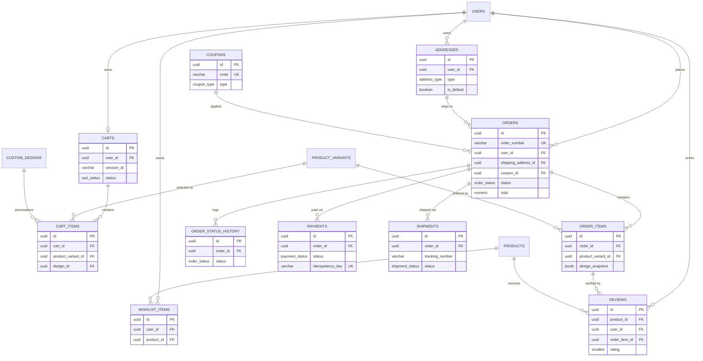
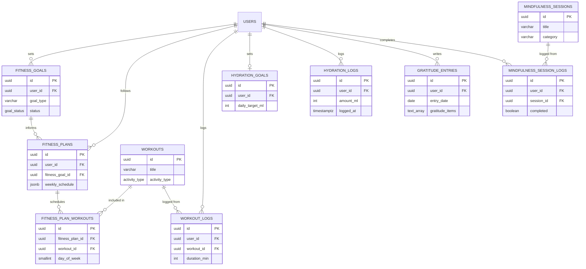
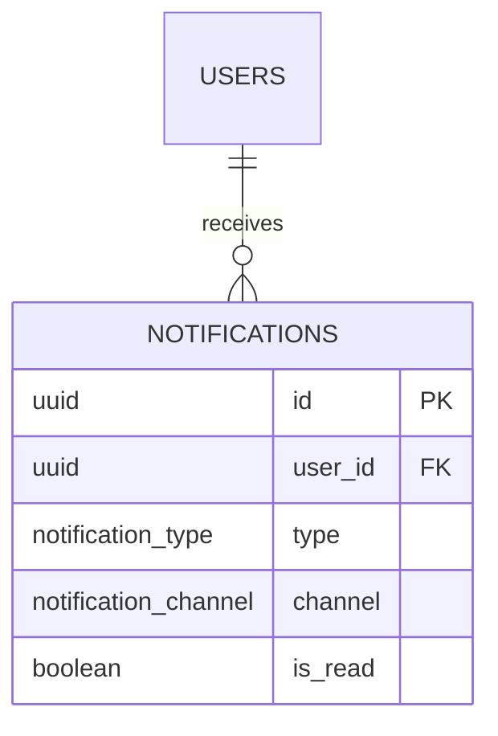

# Wellness E-commerce App — Production Database Schema

> Reference: `ARCHITECTURE.md` (tech stack: PostgreSQL via Supabase)۔ یہ document مکمل، production-ready **PostgreSQL DDL** ہے — ہر table کے Fields/Types/PK/FK/Relationships/Indexes/Constraints کے ساتھ، آخر میں مکمل Mermaid ERD۔ Design-only — یہ migrations ابھی apply نہیں کی گئیں۔

---

## 0. Conventions

| Convention | Rule |
|---|---|
| **Primary Keys** | ہر table پر `uuid primary key default gen_random_uuid()` — distributed-safe, non-guessable, client-side generatable |
| **Timestamps** | `created_at timestamptz not null default now()` ہر table پر؛ mutable tables پر `updated_at` بھی (trigger سے auto-update — نیچے section 3.2) |
| **Soft delete** | صرف user-manageable/reference entities پر (`users`, `products`, `product_variants`, `custom_designs`, `addresses`) — `deleted_at timestamptz null`۔ Financial records (`orders`, `payments`, `order_items`) کبھی delete/soft-delete نہیں ہوتے — یہ immutable audit trail ہیں، صرف status change ہوتا ہے |
| **Money** | `numeric(10,2)` — کبھی float/double استعمال نہ کریں |
| **Enums** | Postgres native `ENUM` types (status fields) — application-level validation کے ساتھ ڈبل-protection |
| **Naming** | snake_case, plural table names, `<entity>_id` FK naming |
| **RLS** | ہر user-owned table پر Row Level Security enabled — section 3.1 |
| **Extensions** | `pgcrypto` (uuid gen), `citext` (case-insensitive email), `pg_trgm` (search, optional) |

```sql
create extension if not exists pgcrypto;
create extension if not exists citext;
create extension if not exists pg_trgm;
```

---

## 1. Enum Types

```sql
create type user_role                as enum ('customer','staff','admin');
create type admin_role               as enum ('super_admin','product_manager','order_manager','support_staff','content_manager');
create type product_status           as enum ('draft','active','archived');
create type customization_opt_type   as enum ('text','image','color','pattern');
create type design_status            as enum ('draft','saved','ordered');
create type design_element_type      as enum ('text','image','color_fill','pattern');
create type cart_status              as enum ('active','converted','abandoned');
create type order_status             as enum ('pending_payment','paid','cod_confirmed','in_production','ready_to_ship','shipped','out_for_delivery','delivered','cancelled','refunded');
create type payment_method           as enum ('card','jazzcash','easypaisa','cod','bank_transfer');
create type payment_status           as enum ('pending','authorized','paid','failed','refunded','partially_refunded');
create type shipment_status          as enum ('pending','label_created','picked_up','in_transit','out_for_delivery','delivered','failed','returned');
create type address_type             as enum ('shipping','billing');
create type coupon_type              as enum ('percentage','fixed_amount','free_shipping');
create type review_status            as enum ('pending','approved','rejected');
create type goal_status              as enum ('active','completed','paused','abandoned');
create type activity_type            as enum ('yoga','walk','run','gym','cycling','swimming','other');
create type notification_channel     as enum ('email','sms','push','in_app');
create type notification_type        as enum ('order_update','wellness_reminder','promotion','system');
```

---

## 2. Tables (grouped by domain)

Tables **دی گئی dependency order میں بنائیں** (FK dependency-safe)۔

### 2.1 Identity Domain

#### `users`
```sql
create table users (
  id                 uuid primary key default gen_random_uuid(),
  email              citext not null unique,
  phone              varchar(20) unique,
  password_hash      text,                          -- null اگر OAuth-only
  role               user_role not null default 'customer',
  auth_provider      varchar(20) not null default 'email',  -- email/google/apple/phone
  email_verified_at  timestamptz,
  phone_verified_at  timestamptz,
  is_active          boolean not null default true,
  last_login_at      timestamptz,
  created_at         timestamptz not null default now(),
  updated_at         timestamptz not null default now(),
  deleted_at         timestamptz
);

create index idx_users_role       on users(role) where deleted_at is null;
create index idx_users_created_at on users(created_at);
```
- **PK:** `id`. **Constraints:** `email` unique (case-insensitive via `citext`), `phone` unique (nulls allowed multiple times).
- **Relationships:** 1:1 → `user_profiles`; 0/1:1 → `admin_users`; 1:N → `orders`, `addresses`, `custom_designs`, `carts`, `reviews`, ہر wellness-log table۔

#### `user_profiles`
```sql
create table user_profiles (
  id                   uuid primary key default gen_random_uuid(),
  user_id              uuid not null unique references users(id) on delete cascade,
  full_name            varchar(150),
  avatar_url           text,
  date_of_birth        date,
  gender               varchar(20),
  wellness_goals       jsonb not null default '{}',
  preferred_language   varchar(10) not null default 'en',
  timezone             varchar(50) not null default 'Asia/Karachi',
  created_at           timestamptz not null default now(),
  updated_at           timestamptz not null default now()
);
```
- **PK:** `id`. **FK:** `user_id → users.id` (unique = enforces 1:1). **Relationships:** 1:1 with `users`.

#### `admin_users`
```sql
create table admin_users (
  id            uuid primary key default gen_random_uuid(),
  user_id       uuid not null unique references users(id) on delete cascade,
  admin_role    admin_role not null default 'support_staff',
  permissions   jsonb not null default '[]',
  department    varchar(100),
  mfa_enabled   boolean not null default false,
  created_by    uuid references admin_users(id),
  created_at    timestamptz not null default now(),
  updated_at    timestamptz not null default now()
);

create index idx_admin_users_role on admin_users(admin_role);
```
- **PK:** `id`. **FK:** `user_id → users.id` (1:1 extension); `created_by → admin_users.id` (self-referencing، کس admin نے یہ staff account بنایا)۔
- **Relationships:** 1:1 with `users` (صرف role=staff/admin رکھنے والے users کے پاس row ہو گی)؛ 1:N → `workouts.created_by`.

---

### 2.2 Catalog Domain

#### `product_categories`
```sql
create table product_categories (
  id             uuid primary key default gen_random_uuid(),
  parent_id      uuid references product_categories(id) on delete set null,
  slug           varchar(150) not null unique,
  name           varchar(150) not null,
  description    text,
  image_url      text,
  display_order  int not null default 0,
  is_active      boolean not null default true,
  created_at     timestamptz not null default now(),
  updated_at     timestamptz not null default now()
);

create index idx_categories_parent on product_categories(parent_id);
```
- **PK:** `id`. **FK:** `parent_id → product_categories.id` (self-referencing tree — subcategories کے لیے)۔
- **Relationships:** 1:N (self) parent→children؛ 1:N → `products`.

#### `products`
```sql
create table products (
  id                  uuid primary key default gen_random_uuid(),
  category_id         uuid not null references product_categories(id) on delete restrict,
  sku_type            varchar(30) not null,   -- yoga_mat/fitness_tracker/diffuser/gum_bag/journal/bottle
  slug                varchar(180) not null unique,
  title               varchar(200) not null,
  description         text,
  base_price          numeric(10,2) not null check (base_price >= 0),
  compare_at_price    numeric(10,2) check (compare_at_price >= 0),
  currency            char(3) not null default 'PKR',
  images              jsonb not null default '[]',
  is_personalizable   boolean not null default false,
  print_area_config   jsonb,                  -- canvas zones config (architecture §9.2)
  status              product_status not null default 'draft',
  avg_rating          numeric(2,1) not null default 0 check (avg_rating between 0 and 5),
  review_count        int not null default 0,
  created_at          timestamptz not null default now(),
  updated_at          timestamptz not null default now(),
  deleted_at          timestamptz
);

create index idx_products_category on products(category_id) where deleted_at is null;
create index idx_products_status   on products(status) where deleted_at is null;
create index idx_products_sku_type on products(sku_type);
create index idx_products_search   on products using gin (
  to_tsvector('english', title || ' ' || coalesce(description,''))
);
```
- **PK:** `id`. **FK:** `category_id → product_categories.id` (`RESTRICT` — products موجود ہوں تو category delete نہ ہو)۔
- **Constraints:** `base_price >= 0`, `avg_rating` bounded 0–5۔ **Index:** GIN full-text search on title+description۔
- **Relationships:** N:1 → category؛ 1:N → `product_variants`, `product_customization_options`, `custom_designs`, `wishlist_items`, `reviews`.

#### `product_variants`
```sql
create table product_variants (
  id                  uuid primary key default gen_random_uuid(),
  product_id          uuid not null references products(id) on delete cascade,
  sku                 varchar(80) not null unique,
  size                varchar(50),
  color               varchar(50),
  price_delta         numeric(10,2) not null default 0,
  stock_qty           int not null default 0 check (stock_qty >= 0),
  low_stock_threshold int not null default 5,
  weight_grams        int,
  is_active           boolean not null default true,
  created_at          timestamptz not null default now(),
  updated_at          timestamptz not null default now(),
  unique (product_id, size, color)
);

create index idx_variants_product   on product_variants(product_id);
create index idx_variants_low_stock on product_variants(stock_qty) where stock_qty <= low_stock_threshold;
```
- **PK:** `id`. **FK:** `product_id → products.id` (`CASCADE`)۔ **Constraints:** `stock_qty >= 0`; unique `(product_id,size,color)` combo۔
- **Relationships:** N:1 → product؛ 1:N → `cart_items`, `order_items`.

#### `product_customization_options`
```sql
create table product_customization_options (
  id             uuid primary key default gen_random_uuid(),
  product_id     uuid not null references products(id) on delete cascade,
  option_type    customization_opt_type not null,
  label          varchar(100) not null,
  zone_key       varchar(80) not null,       -- print_area_config کے zone id سے match
  constraints    jsonb not null default '{}', -- max_chars, fonts[], palette[], allowed_formats[]
  is_required    boolean not null default false,
  display_order  int not null default 0,
  created_at     timestamptz not null default now(),
  unique (product_id, zone_key)
);

create index idx_custom_options_product on product_customization_options(product_id);
```
- **PK:** `id`. **FK:** `product_id → products.id`. **Constraints:** unique `(product_id, zone_key)`.
- **Relationships:** N:1 → product؛ 1:N → `design_elements` (via `customization_option_id`)۔

---

### 2.3 Personalization Domain

#### `custom_designs`
```sql
create table custom_designs (
  id                 uuid primary key default gen_random_uuid(),
  user_id            uuid not null references users(id) on delete cascade,
  product_id         uuid not null references products(id) on delete restrict,
  name               varchar(150),
  status             design_status not null default 'draft',
  preview_image_url  text,
  render_image_url   text,       -- high-res print-ready render (fulfillment کے لیے)
  is_template        boolean not null default false,
  is_public          boolean not null default false,
  created_at         timestamptz not null default now(),
  updated_at         timestamptz not null default now(),
  deleted_at         timestamptz
);

create index idx_designs_user    on custom_designs(user_id) where deleted_at is null;
create index idx_designs_product on custom_designs(product_id);
create index idx_designs_status  on custom_designs(status);
```
- **PK:** `id`. **FK:** `user_id → users.id`, `product_id → products.id` (`RESTRICT` — product delete سے designs orphan نہ ہوں)۔
- **Relationships:** N:1 → user, N:1 → product؛ 1:N → `design_elements`; 0/1:N → `cart_items.design_id`.

#### `design_elements`
```sql
create table design_elements (
  id                       uuid primary key default gen_random_uuid(),
  design_id                uuid not null references custom_designs(id) on delete cascade,
  customization_option_id  uuid references product_customization_options(id) on delete set null,
  element_type             design_element_type not null,
  zone_key                 varchar(80) not null,
  content                  text,          -- text value یا uploaded image URL
  font_family              varchar(80),
  color_hex                varchar(7),
  position_x               numeric(8,2),
  position_y               numeric(8,2),
  scale                    numeric(5,2) not null default 1.0,
  rotation                 numeric(5,2) not null default 0.0,
  z_index                  int not null default 0,
  created_at               timestamptz not null default now(),
  updated_at               timestamptz not null default now()
);

create index idx_design_elements_design on design_elements(design_id);
```
- **PK:** `id`. **FK:** `design_id → custom_designs.id` (`CASCADE`), `customization_option_id → product_customization_options.id` (`SET NULL`)۔
- **Relationships:** N:1 → design (ایک design کی متعدد layers/elements — normalized بجائے pure-JSON blob کے، تاکہ layer-level query/audit ممکن ہو)۔

---

### 2.4 Commerce Domain

#### `coupons`
```sql
create table coupons (
  id                   uuid primary key default gen_random_uuid(),
  code                 varchar(40) not null unique,
  type                 coupon_type not null,
  value                numeric(10,2) not null check (value >= 0),
  min_order_amount     numeric(10,2) default 0,
  max_discount_amount  numeric(10,2),
  usage_limit          int,
  usage_count          int not null default 0,
  per_user_limit       int default 1,
  starts_at            timestamptz,
  expires_at           timestamptz,
  is_active            boolean not null default true,
  created_at           timestamptz not null default now()
);

create index idx_coupons_code on coupons(code) where is_active = true;
```
- **Relationships:** 1:N → `orders`.

#### `addresses`
```sql
create table addresses (
  id           uuid primary key default gen_random_uuid(),
  user_id      uuid not null references users(id) on delete cascade,
  type         address_type not null default 'shipping',
  full_name    varchar(150) not null,
  phone        varchar(20) not null,
  line1        varchar(200) not null,
  line2        varchar(200),
  city         varchar(100) not null,
  state        varchar(100),
  postal_code  varchar(20),
  country      char(2) not null default 'PK',
  is_default   boolean not null default false,
  created_at   timestamptz not null default now(),
  updated_at   timestamptz not null default now(),
  deleted_at   timestamptz
);

create index idx_addresses_user on addresses(user_id) where deleted_at is null;
create unique index idx_addresses_one_default
  on addresses(user_id, type) where is_default = true and deleted_at is null;
```
- **PK:** `id`. **FK:** `user_id → users.id`. **Constraint:** partial-unique index ensures **صرف ایک default address per type per user**۔
- **Relationships:** N:1 → user؛ 1:N → `orders` (shipping/billing).

#### `carts`
```sql
create table carts (
  id          uuid primary key default gen_random_uuid(),
  user_id     uuid references users(id) on delete cascade,
  session_id  varchar(100),       -- guest cart support
  status      cart_status not null default 'active',
  created_at  timestamptz not null default now(),
  updated_at  timestamptz not null default now(),
  check (user_id is not null or session_id is not null)
);

create unique index idx_carts_one_active_per_user
  on carts(user_id) where status = 'active' and user_id is not null;
create index idx_carts_session on carts(session_id) where session_id is not null;
```
- **Constraint:** `user_id` یا `session_id` میں سے کم از کم ایک required (guest checkout support)۔ Partial-unique index — logged-in user کا صرف ایک active cart ہو سکتا ہے۔
- **Relationships:** N:1 → user (optional)؛ 1:N → `cart_items`.

#### `cart_items`
```sql
create table cart_items (
  id                  uuid primary key default gen_random_uuid(),
  cart_id             uuid not null references carts(id) on delete cascade,
  product_variant_id  uuid not null references product_variants(id) on delete restrict,
  design_id           uuid references custom_designs(id) on delete set null,
  quantity            int not null default 1 check (quantity > 0),
  unit_price          numeric(10,2) not null check (unit_price >= 0),
  created_at          timestamptz not null default now(),
  updated_at          timestamptz not null default now(),
  unique (cart_id, product_variant_id, design_id)
);

create index idx_cart_items_cart on cart_items(cart_id);
```
- **Relationships:** N:1 → cart, N:1 → variant, 0/1:N → design۔ Unique combo ایک ہی item دو بار line-item کے طور پر نہ آئے (بلکہ qty بڑھے)۔

#### `orders`
```sql
create table orders (
  id                    uuid primary key default gen_random_uuid(),
  order_number          varchar(20) not null unique,   -- human-readable e.g. WL-100234
  user_id               uuid not null references users(id) on delete restrict,
  status                order_status not null default 'pending_payment',
  shipping_address_id   uuid not null references addresses(id) on delete restrict,
  billing_address_id    uuid references addresses(id) on delete restrict,
  coupon_id             uuid references coupons(id) on delete set null,
  subtotal              numeric(10,2) not null check (subtotal >= 0),
  discount_amount       numeric(10,2) not null default 0 check (discount_amount >= 0),
  shipping_fee          numeric(10,2) not null default 0,
  tax_amount            numeric(10,2) not null default 0,
  total                 numeric(10,2) not null check (total >= 0),
  currency              char(3) not null default 'PKR',
  payment_method        payment_method not null,
  placed_at             timestamptz,
  created_at            timestamptz not null default now(),
  updated_at            timestamptz not null default now()
);

create index idx_orders_user       on orders(user_id);
create index idx_orders_status     on orders(status);
create index idx_orders_placed_at  on orders(placed_at);
```
- **PK:** `id`. **FK:** `user_id → users.id` (`RESTRICT` — order history preserve ہو، user delete نہیں ہوتا صرف deactivate)، addresses (`RESTRICT`), `coupon_id` (`SET NULL`)۔
- **نوٹ:** کبھی delete/soft-delete نہیں — یہ immutable financial record ہے، صرف `status` بدلتا ہے (`order_status_history` میں tracked)۔
- **Relationships:** N:1 → user, N:1 → shipping/billing address, 0/1:N → coupon؛ 1:N → `order_items`, `payments`, `shipments`, `order_status_history`.

#### `order_items`
```sql
create table order_items (
  id                    uuid primary key default gen_random_uuid(),
  order_id              uuid not null references orders(id) on delete cascade,
  product_variant_id    uuid not null references product_variants(id) on delete restrict,
  design_snapshot       jsonb,          -- order کے وقت design_elements کا frozen copy
  product_title         varchar(200) not null,  -- denormalized snapshot (historical accuracy)
  variant_label         varchar(100),
  quantity              int not null check (quantity > 0),
  unit_price            numeric(10,2) not null check (unit_price >= 0),
  line_total            numeric(10,2) not null check (line_total >= 0),
  fulfillment_status    varchar(30) not null default 'pending',
  created_at            timestamptz not null default now()
);

create index idx_order_items_order   on order_items(order_id);
create index idx_order_items_variant on order_items(product_variant_id);
```
- **اہم design فیصلہ:** `product_title`, `unit_price`, `design_snapshot` **denormalized/frozen** ہیں — بعد میں product price/design تبدیل ہو جائے تو بھی پرانا order accurate رہے۔
- **Relationships:** N:1 → order (`CASCADE`), N:1 → variant (`RESTRICT`)۔ 1:N → `reviews` (verified-purchase link)۔

#### `order_status_history`
```sql
create table order_status_history (
  id          uuid primary key default gen_random_uuid(),
  order_id    uuid not null references orders(id) on delete cascade,
  status      order_status not null,
  note        text,
  changed_by  uuid references users(id),
  created_at  timestamptz not null default now()
);

create index idx_order_history_order on order_status_history(order_id, created_at);
```
- **مقصد:** Order tracking screen + admin audit — architecture کے order state machine کا log۔

#### `payments`
```sql
create table payments (
  id                  uuid primary key default gen_random_uuid(),
  order_id            uuid not null references orders(id) on delete restrict,
  provider            varchar(30) not null,     -- stripe/jazzcash/easypaisa/cod
  provider_reference  varchar(150),
  amount              numeric(10,2) not null check (amount >= 0),
  currency            char(3) not null default 'PKR',
  status              payment_status not null default 'pending',
  idempotency_key     varchar(100) unique,
  raw_response        jsonb,
  paid_at             timestamptz,
  created_at          timestamptz not null default now(),
  updated_at          timestamptz not null default now()
);

create index idx_payments_order  on payments(order_id);
create index idx_payments_status on payments(status);
create unique index idx_payments_provider_ref
  on payments(provider, provider_reference) where provider_reference is not null;
```
- **Constraint:** `idempotency_key` unique (duplicate-charge prevention)؛ `(provider, provider_reference)` unique (webhook replay-safe)۔
- **Relationships:** N:1 → order (ایک order کے متعدد payment attempts ہو سکتے ہیں — retry/partial)۔

#### `shipments`
```sql
create table shipments (
  id                  uuid primary key default gen_random_uuid(),
  order_id            uuid not null references orders(id) on delete cascade,
  carrier             varchar(80),
  tracking_number     varchar(100),
  status              shipment_status not null default 'pending',
  shipped_at          timestamptz,
  delivered_at        timestamptz,
  estimated_delivery  date,
  created_at          timestamptz not null default now(),
  updated_at          timestamptz not null default now()
);

create index idx_shipments_order on shipments(order_id);
create unique index idx_shipments_tracking
  on shipments(carrier, tracking_number) where tracking_number is not null;
```
- **Relationships:** N:1 → order (ایک order کبھی-کبھار multiple shipments میں split ہو سکتا ہے — partial fulfillment)۔

#### `wishlist_items`
```sql
create table wishlist_items (
  id          uuid primary key default gen_random_uuid(),
  user_id     uuid not null references users(id) on delete cascade,
  product_id  uuid not null references products(id) on delete cascade,
  created_at  timestamptz not null default now(),
  unique (user_id, product_id)
);

create index idx_wishlist_user on wishlist_items(user_id);
```

#### `reviews`
```sql
create table reviews (
  id             uuid primary key default gen_random_uuid(),
  product_id     uuid not null references products(id) on delete cascade,
  user_id        uuid not null references users(id) on delete cascade,
  order_item_id  uuid references order_items(id) on delete set null,  -- verified-purchase link
  rating         smallint not null check (rating between 1 and 5),
  title          varchar(150),
  comment        text,
  status         review_status not null default 'pending',
  created_at     timestamptz not null default now(),
  updated_at     timestamptz not null default now(),
  unique (product_id, user_id, order_item_id)
);

create index idx_reviews_product on reviews(product_id) where status = 'approved';
```
- **نوٹ:** `products.avg_rating`/`review_count` trigger کے ذریعے یہاں سے update ہوں (denormalized aggregate — read-heavy product page کے لیے fast)۔

---

### 2.5 Wellness Domain

#### `fitness_goals`
```sql
create table fitness_goals (
  id            uuid primary key default gen_random_uuid(),
  user_id       uuid not null references users(id) on delete cascade,
  goal_type     varchar(50) not null,   -- weight_loss/flexibility/strength/general_activity
  target_value  numeric(10,2),
  target_unit   varchar(20),
  target_date   date,
  status        goal_status not null default 'active',
  created_at    timestamptz not null default now(),
  updated_at    timestamptz not null default now()
);

create index idx_fitness_goals_user on fitness_goals(user_id, status);
```

#### `workouts` (content catalog — admin-curated)
```sql
create table workouts (
  id                 uuid primary key default gen_random_uuid(),
  title              varchar(150) not null,
  activity_type      activity_type not null,
  description        text,
  duration_min       int not null check (duration_min > 0),
  difficulty         varchar(20),      -- beginner/intermediate/advanced
  calories_estimate  int,
  video_url          text,
  created_by         uuid references admin_users(id),
  is_active          boolean not null default true,
  created_at         timestamptz not null default now()
);

create index idx_workouts_activity_type on workouts(activity_type) where is_active = true;
```

#### `fitness_plans`
```sql
create table fitness_plans (
  id               uuid primary key default gen_random_uuid(),
  user_id          uuid not null references users(id) on delete cascade,
  fitness_goal_id  uuid references fitness_goals(id) on delete set null,
  title            varchar(150) not null,
  plan_type        varchar(30) not null default 'weekly',
  weekly_schedule  jsonb not null default '{}',
  is_active        boolean not null default true,
  starts_on        date not null default current_date,
  ends_on          date,
  created_at       timestamptz not null default now(),
  updated_at       timestamptz not null default now()
);

create index idx_fitness_plans_user on fitness_plans(user_id) where is_active = true;
```

#### `fitness_plan_workouts` (junction — plan schedule)
```sql
create table fitness_plan_workouts (
  id               uuid primary key default gen_random_uuid(),
  fitness_plan_id  uuid not null references fitness_plans(id) on delete cascade,
  workout_id       uuid not null references workouts(id) on delete cascade,
  day_of_week      smallint not null check (day_of_week between 0 and 6),
  display_order    int not null default 0,
  unique (fitness_plan_id, workout_id, day_of_week)
);

create index idx_plan_workouts_plan on fitness_plan_workouts(fitness_plan_id);
```
- **مقصد:** N:M بین `fitness_plans` اور `workouts` — ہر plan میں ہفتے کے کس دن کونسا workout ہے۔

#### `workout_logs`
```sql
create table workout_logs (
  id               uuid primary key default gen_random_uuid(),
  user_id          uuid not null references users(id) on delete cascade,
  workout_id       uuid references workouts(id) on delete set null,
  activity_type    activity_type not null,
  duration_min     int not null check (duration_min > 0),
  calories_burned  int,
  notes            text,
  logged_at        timestamptz not null default now(),
  created_at       timestamptz not null default now()
);

create index idx_workout_logs_user_date on workout_logs(user_id, logged_at desc);
```
- **Scale نوٹ:** high-write table — production میں `logged_at` پر **monthly range partitioning** پر غور کریں (section 3.3)۔

#### `hydration_goals`
```sql
create table hydration_goals (
  id                      uuid primary key default gen_random_uuid(),
  user_id                 uuid not null unique references users(id) on delete cascade,
  daily_target_ml         int not null default 2000 check (daily_target_ml > 0),
  reminder_enabled        boolean not null default true,
  reminder_interval_min   int default 120,
  updated_at              timestamptz not null default now()
);
```
- **Relationship:** 1:1 with user (current active goal؛ history کی ضرورت نہیں، صرف latest target)۔

#### `hydration_logs`
```sql
create table hydration_logs (
  id          uuid primary key default gen_random_uuid(),
  user_id     uuid not null references users(id) on delete cascade,
  amount_ml   int not null check (amount_ml > 0),
  logged_at   timestamptz not null default now()
);

create index idx_hydration_logs_user_date on hydration_logs(user_id, logged_at desc);
```
- **Scale نوٹ:** highest-frequency table متوقع — partitioning candidate #1۔

#### `gratitude_entries`
```sql
create table gratitude_entries (
  id                uuid primary key default gen_random_uuid(),
  user_id           uuid not null references users(id) on delete cascade,
  prompt            text,
  gratitude_items   text[] not null default '{}',
  content           text,
  mood              varchar(20),
  entry_date        date not null default current_date,
  created_at        timestamptz not null default now(),
  updated_at        timestamptz not null default now(),
  unique (user_id, entry_date)
);

create index idx_gratitude_user_date on gratitude_entries(user_id, entry_date desc);
```
- **Constraint:** ایک user کی روزانہ ایک entry (product rule — چاہیں تو relax کیا جا سکتا ہے)۔
- **Privacy نوٹ:** sensitive content — encryption-at-rest (Supabase default) کافی ہے، مگر analytics pipeline میں `content`/`gratitude_items` raw کبھی export نہ ہو۔

#### `mindfulness_sessions` (content catalog)
```sql
create table mindfulness_sessions (
  id            uuid primary key default gen_random_uuid(),
  title         varchar(150) not null,
  category      varchar(30) not null,   -- breathing/body_scan/sleep/focus
  description   text,
  audio_url     text not null,
  duration_sec  int not null check (duration_sec > 0),
  is_active     boolean not null default true,
  created_at    timestamptz not null default now()
);

create index idx_mindfulness_category on mindfulness_sessions(category) where is_active = true;
```

#### `mindfulness_session_logs`
```sql
create table mindfulness_session_logs (
  id                       uuid primary key default gen_random_uuid(),
  user_id                  uuid not null references users(id) on delete cascade,
  session_id               uuid not null references mindfulness_sessions(id) on delete cascade,
  duration_listened_sec    int not null default 0,
  completed                boolean not null default false,
  logged_at                timestamptz not null default now()
);

create index idx_mindfulness_logs_user on mindfulness_session_logs(user_id, logged_at desc);
```

---

### 2.6 Platform Domain

#### `notifications`
```sql
create table notifications (
  id          uuid primary key default gen_random_uuid(),
  user_id     uuid not null references users(id) on delete cascade,
  type        notification_type not null,
  channel     notification_channel not null,
  title       varchar(150) not null,
  body        text,
  data        jsonb default '{}',
  is_read     boolean not null default false,
  sent_at     timestamptz,
  created_at  timestamptz not null default now()
);

create index idx_notifications_user_unread on notifications(user_id) where is_read = false;
create index idx_notifications_created      on notifications(created_at);
```

---

## 3. Production-Readiness Notes

### 3.1 Row Level Security (Supabase/Postgres)
ہر user-owned table پر RLS enable ہو، مثال:
```sql
alter table hydration_logs enable row level security;

create policy "users can manage own hydration logs"
  on hydration_logs for all
  using (auth.uid() = user_id)
  with check (auth.uid() = user_id);
```
یہی pattern لاگو ہو: `user_profiles`, `addresses`, `custom_designs`, `design_elements` (via design ownership), `carts`, `cart_items`, `wishlist_items`, `fitness_goals`, `fitness_plans`, `workout_logs`, `hydration_goals/logs`, `gratitude_entries`, `mindfulness_session_logs`, `notifications`, `orders`/`order_items`/`payments`/`shipments` (read-only own-records policy)۔
Admin/staff role کے لیے separate bypass policy (`role() = 'service_role'` یا `exists (select 1 from admin_users where user_id = auth.uid())`)۔

### 3.2 `updated_at` Auto-Update Trigger
```sql
create or replace function set_updated_at()
returns trigger as $$
begin
  new.updated_at = now();
  return new;
end;
$$ language plpgsql;

-- ہر mutable table پر:
create trigger trg_set_updated_at before update on products
  for each row execute function set_updated_at();
-- (اسی طرح باقی سب updated_at-bearing tables پر repeat کریں)
```

### 3.3 Scalability — Partitioning Candidates
High-write, append-mostly tables جو تیزی سے بڑی ہوں گی — production میں **monthly range partitioning** (`logged_at`/`created_at` پر) recommended:
- `hydration_logs`
- `workout_logs`
- `mindfulness_session_logs`
- `notifications`
- `order_status_history`

```sql
-- مثال pattern:
create table hydration_logs (
  ...
) partition by range (logged_at);

create table hydration_logs_2026_08 partition of hydration_logs
  for values from ('2026-08-01') to ('2026-09-01');
```

### 3.4 Aggregate/Denormalization Strategy
- `products.avg_rating` / `review_count` — trigger-maintained on `reviews` insert/update (avoids expensive `AVG()` on every product-page load)۔
- Streaks (hydration/journal/fitness) — **materialized view یا scheduled job** سے compute کریں (`hydration_logs`/`gratitude_entries` سے derive)، ایک الگ mutable `streaks` table رکھنا optional ہے — recommend: nightly job + cached value in `user_profiles.wellness_goals` یا الگ lightweight `user_streaks` table (out of MVP scope)۔

### 3.5 Referential Integrity Philosophy
- **`RESTRICT`** on financial/historical links (users→orders, products→order line references indirectly via variants) — تاکہ history کبھی silently غائب نہ ہو۔
- **`CASCADE`** صرف parent-owns-child relationships پر (cart→cart_items, design→design_elements, order→order_items)۔
- **`SET NULL`** optional/reference-only links پر (coupon on order, workout on log)۔

---

## 4. Complete ERD (Mermaid)

> بڑا schema ہونے کی وجہ سے readability کے لیے domain کے مطابق 4 diagrams میں split کیا گیا ہے (تمام tables/relationships مکمل طور پر cover ہوتی ہیں)۔

### 4.1 Identity + Catalog + Personalization



### 4.2 Commerce (Cart → Order → Fulfillment)



### 4.3 Wellness Ecosystem



### 4.4 Platform (Notifications)



---

## 5. Table Inventory (Summary)

| # | Table | Domain | Key Relationship |
|---|---|---|---|
| 1 | `users` | Identity | root entity |
| 2 | `user_profiles` | Identity | 1:1 users |
| 3 | `admin_users` | Identity | 1:1 users |
| 4 | `product_categories` | Catalog | self-referencing tree |
| 5 | `products` | Catalog | N:1 categories |
| 6 | `product_variants` | Catalog | N:1 products |
| 7 | `product_customization_options` | Catalog | N:1 products |
| 8 | `custom_designs` | Personalization | N:1 users, products |
| 9 | `design_elements` | Personalization | N:1 custom_designs |
| 10 | `coupons` | Commerce | referenced by orders |
| 11 | `addresses` | Commerce | N:1 users |
| 12 | `carts` | Commerce | N:1 users (nullable, guest) |
| 13 | `cart_items` | Commerce | N:1 carts, variants |
| 14 | `orders` | Commerce | N:1 users, addresses |
| 15 | `order_items` | Commerce | N:1 orders |
| 16 | `order_status_history` | Commerce | N:1 orders |
| 17 | `payments` | Commerce | N:1 orders |
| 18 | `shipments` | Commerce | N:1 orders |
| 19 | `wishlist_items` | Commerce | N:1 users, products |
| 20 | `reviews` | Commerce | N:1 users, products |
| 21 | `fitness_goals` | Wellness | N:1 users |
| 22 | `workouts` | Wellness | content catalog |
| 23 | `fitness_plans` | Wellness | N:1 users, goals |
| 24 | `fitness_plan_workouts` | Wellness | N:M plans↔workouts |
| 25 | `workout_logs` | Wellness | N:1 users |
| 26 | `hydration_goals` | Wellness | 1:1 users |
| 27 | `hydration_logs` | Wellness | N:1 users |
| 28 | `gratitude_entries` | Wellness | N:1 users |
| 29 | `mindfulness_sessions` | Wellness | content catalog |
| 30 | `mindfulness_session_logs` | Wellness | N:1 users, sessions |
| 31 | `notifications` | Platform | N:1 users |

**Total: 31 tables** (requested entities + supporting junction/audit tables — `order_status_history`, `fitness_plan_workouts`, `mindfulness_session_logs` — production completeness کے لیے ضروری)۔

---

*یہ schema `ARCHITECTURE.md` اور `UI_UX_SPECIFICATION.md` کے ساتھ implementation-ready foundation بناتا ہے۔ اگلا step (approval کے بعد): Supabase میں actual migrations apply کرنا + RLS policies + seed data۔*
